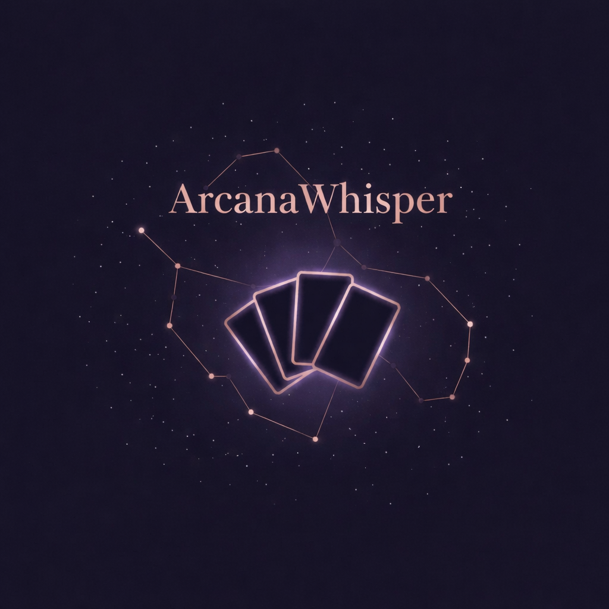
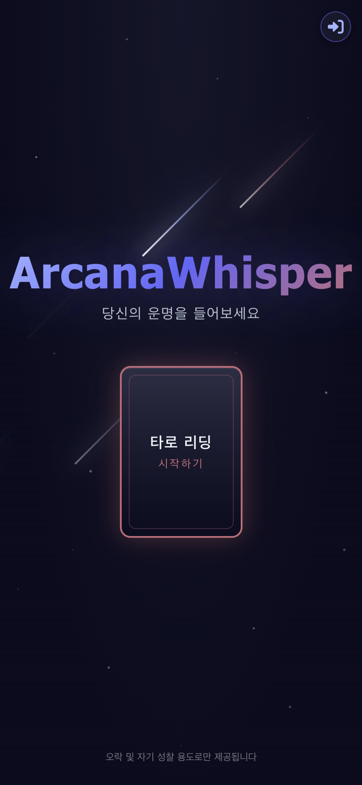
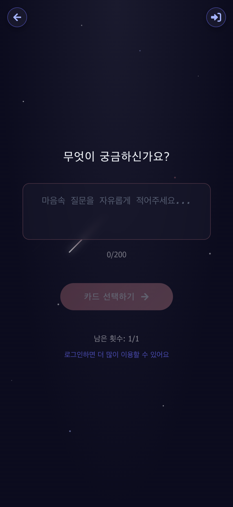
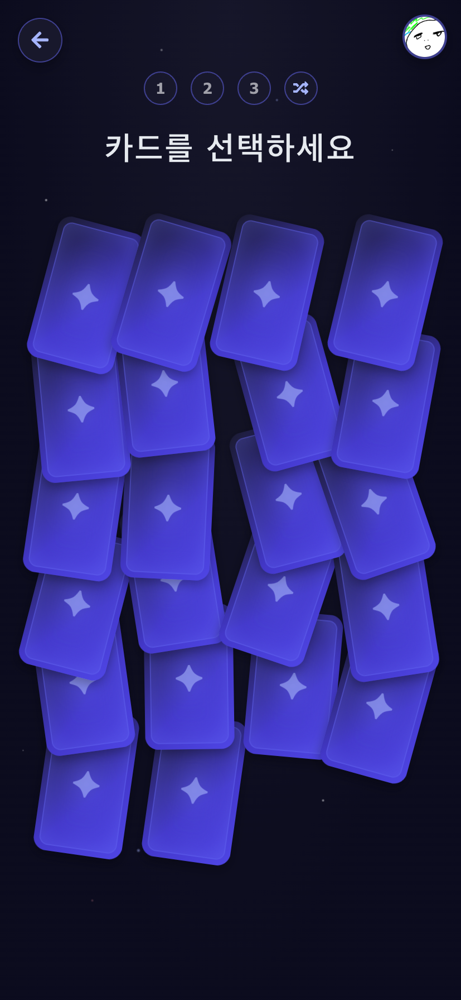
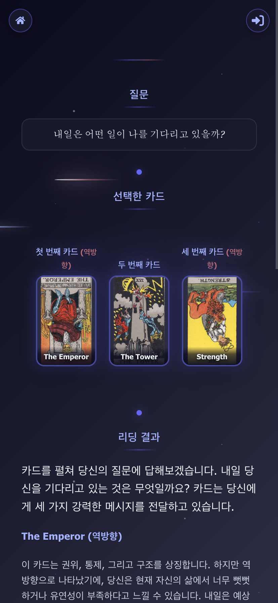

# ArcanaWhisper

<p align="center">
  <strong>AI 기반 타로 리딩 서비스</strong>
</p>

<p align="center">
  
  
  
  
</p>



---

## 소개

ArcanaWhisper는 AI가 타로 카드를 해석해주는 웹 서비스입니다. 사용자가 질문을 입력하고 3장의 카드를 선택하면, AI가 카드의 의미와 질문에 대한 통찰을 제공합니다.

### 핵심 가치

- **프리미엄** - 고급스럽고 세련된 사용자 경험
- **차분함** - 과하지 않은 절제된 시각적 표현
- **모바일 우선** - 언제 어디서나 편리하게

---

## 스크린샷

<!--
  [스크린샷 촬영 가이드]
  - 크기: 모바일 비율 권장 (390x844px) 또는 데스크톱 (1440x900px)
  - 배경: 다크 테마 그대로 촬영
  - 저장 위치: assets/readme/
-->

<p align="center">
  
  
  
  
</p>

<p align="center">
  <em>홈 | 질문 입력 | 카드 선택 | 결과</em>
</p>

---

## 주요 기능

| 기능          | 설명                                          |
| ------------- | --------------------------------------------- |
| 타로 리딩     | 질문 입력 후 3장의 카드를 선택하면 AI가 해석  |
| 정/역방향     | 각 카드마다 무작위로 정방향/역방향 결정       |
| 히스토리      | 이전 리딩 기록 확인 (로그인 필요)             |
| 사용량 제한   | 일일 무료 이용 횟수 제한, 로그인 시 추가 제공 |
| Google 로그인 | Firebase Auth 기반 간편 로그인                |

---

## 기술 스택

| 영역       | 기술                         |
| ---------- | ---------------------------- |
| 프레임워크 | React 19 + Vite 6            |
| 언어       | TypeScript 5.7               |
| 스타일링   | Plain CSS (컴포넌트별 분리)  |
| 라우팅     | react-router-dom v7          |
| 상태관리   | React Context                |
| 인증       | Firebase Auth (Google OAuth) |
| 아이콘     | react-icons (FontAwesome)    |
| API        | AWS Lambda                   |

---

## 시작하기

### 사전 요구사항

- Node.js 18+
- npm 또는 yarn
- Firebase 프로젝트 (Auth 활성화)

### 설치

```bash
# 저장소 클론
git clone https://github.com/your-username/arcana-whisper-front.git

# 디렉토리 이동
cd arcana-whisper-front/arcana-whiper-front

# 의존성 설치
npm install
```

### 환경 변수 설정

`.env.local` 파일을 생성하고 다음 변수를 설정합니다:

```env
# Firebase 설정
VITE_FIREBASE_API_KEY=your-api-key
VITE_FIREBASE_AUTH_DOMAIN=your-project.firebaseapp.com
VITE_FIREBASE_PROJECT_ID=your-project-id
VITE_FIREBASE_STORAGE_BUCKET=your-project.appspot.com
VITE_FIREBASE_MESSAGING_SENDER_ID=your-sender-id
VITE_FIREBASE_APP_ID=your-app-id

# API 서버
VITE_API_URL=https://your-api-endpoint.amazonaws.com
```

### 개발 서버 실행

```bash
npm run dev
```

브라우저에서 `http://localhost:5173` 접속

### 프로덕션 빌드

```bash
npm run build
npm run preview
```

---

## 프로젝트 구조

```
arcana-whiper-front/
├── src/
│   ├── components/     # UI 컴포넌트
│   ├── pages/          # 페이지 컴포넌트
│   ├── contexts/       # React Context
│   ├── hooks/          # 커스텀 훅
│   ├── services/       # API 서비스
│   ├── styles/         # CSS 파일
│   ├── data/           # 정적 데이터
│   ├── types/          # TypeScript 타입
│   └── utils/          # 유틸리티 함수
├── public/             # 정적 파일
└── docs/               # 프로젝트 문서
```

---

## 디자인 시스템

### Celestial 컬러 팔레트

우주적이고 세련된 분위기의 딥 인디고 + 코퍼(로즈골드) 조합

| 역할          | 색상       | HEX       |
| ------------- | ---------- | --------- |
| 배경          | Cosmos     | `#0C0C1E` |
| 표면          | Deep Space | `#1A1A2E` |
| 액센트        | Indigo     | `#6366F1` |
| 따뜻한 액센트 | Copper     | `#B76E79` |
| 텍스트        | Starlight  | `#F1F5F9` |

<!-- ---

## 라이센스

이 프로젝트는 MIT 라이센스를 따릅니다. 자세한 내용은 [LICENSE](LICENSE) 파일을 참조하세요. -->
